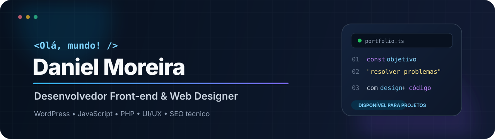

  

  
  
  

  Crio <strong>landing pages, sites WordPress e ferramentas web</strong> com foco em visual, desempenho, responsividade e experiência do usuário.

## 🛠️ Tecnologias e ferramentas

  

## 📊 Painel do GitHub

  
  

  

  Desenvolvimento front-end, WordPress e interfaces feitas para funcionar bem de verdade.

